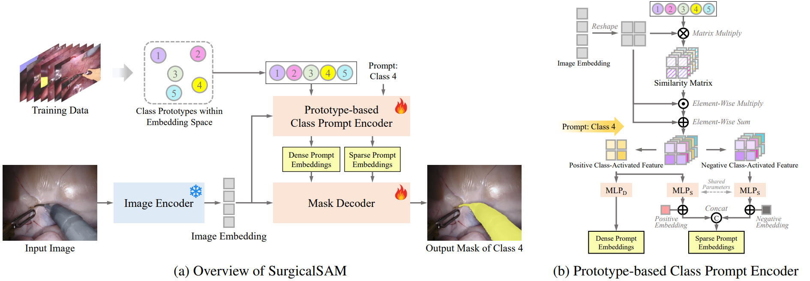
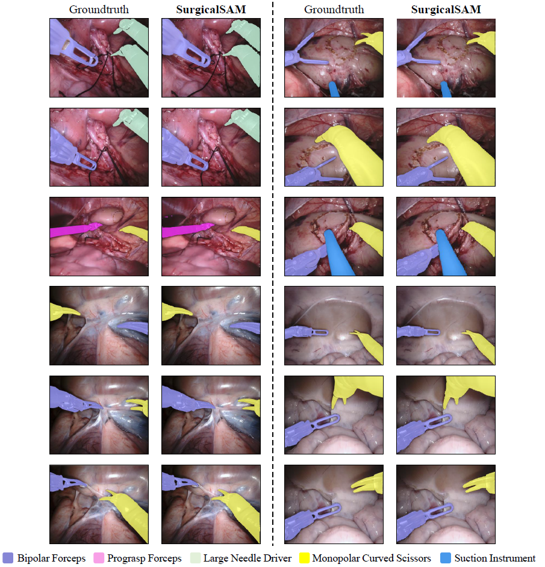
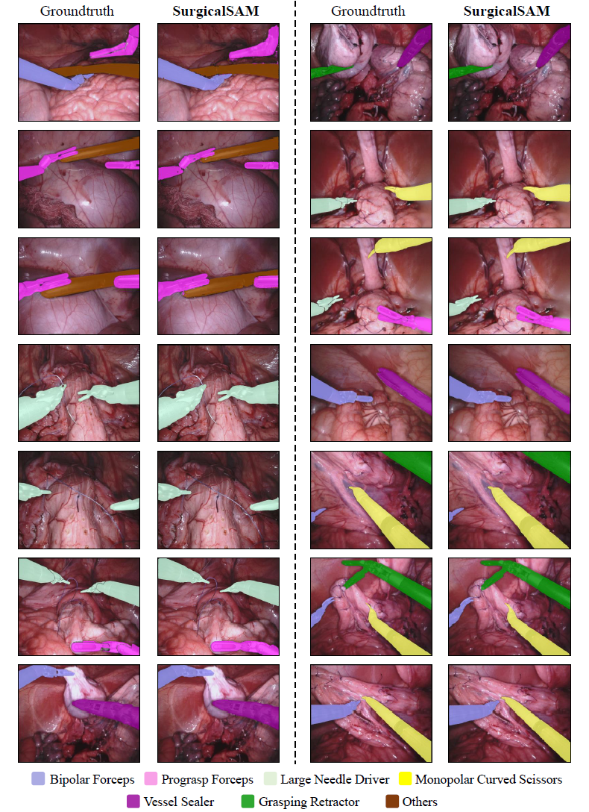

<h2 align="center"> [AAAI2024] SurgicalSAM: Efficient Class Promptable Surgical Instrument Segmentation </h2>
<p align="center">
<a href="https://arxiv.org/abs/2308.08746v2">"></a>
</p>
<h5 align="center"><em>Wenxi Yue, Jing Zhang, Kun Hu, Yong Xia, Jiebo Luo, Zhiyong Wang</em></h5>
<p align="center">
  <a href="#news">News</a> |
  <a href="#abstract">Abstract</a> |
  <a href="#results">Results</a> |
  <a href="#installation">Installation</a> |
  <a href="#data">Data</a> |
  <a href="#checkpoints">Checkpoints</a> |
  <a href="#train">Train</a> |
  <a href="#inference">Inference</a>
</p>

## News 

**2023.12.28** - Our paper is accepted to **AAAI2024**. The processed training data, data preprocessing code, and training code are released.

**2023.09.06** - The processed validation data, checkpoints, and inference code are released. 

**2023.08.21** - The tech report is posted on arxiv. Work in progress.

> Please also check out our latest work SurgicalPart-SAM for text promptable surgical instrument segmentation:
> **SurgicalPart-SAM: Part-to-Whole Collaborative Prompting for Surgical Instrument Segmentation** ([**Paper**](https://arxiv.org/pdf/2312.14481.pdf) and [**Code**](https://github.com/wenxi-yue/SurgicalPart-SAM)).


## Abstract 
The Segment Anything Model (SAM) is a powerful foundation model that has revolutionised image segmentation. To apply SAM to surgical instrument segmentation, a common approach is to locate precise points or boxes of instruments and then use them as prompts for SAM in a zero-shot manner. However, we observe two problems with this naive pipeline: (1) the domain gap between natural objects and surgical instruments leads to poor generalisation of SAM; and (2) SAM relies on precise point or box locations for accurate segmentation, requiring either extensive manual guidance or a well-performing specialist detector for prompt preparation, which leads to a complex multi-stage pipeline. To address these problems, we introduce SurgicalSAM, a novel end-to-end efficient-tuning approach for SAM to effectively integrate surgical-specific information with SAM's pre-trained knowledge for improved generalisation. Specifically, we propose a lightweight prototype-based class prompt encoder for tuning, which directly generates prompt embeddings from class prototypes and eliminates the use of explicit prompts for improved robustness and a simpler pipeline. In addition, to address the low inter-class variance among surgical instrument categories, we propose contrastive prototype learning, further enhancing the discrimination of the class prototypes for more accurate class prompting. The results of extensive experiments on both EndoVis2018 and EndoVis2017 datasets demonstrate that SurgicalSAM achieves state-of-the-art performance while only requiring a small number of tunable parameters.


<figcaption align = "center"><b>Figure 1: Overview of SurgicalSAM. 
 </b></figcaption>
 
## Results

<p align="center">
  
</p>

<p align="center">
  
</p>
<figcaption align = "center"><b>Figure 2: Visualisation Results of SurgicalSAM.
 </b></figcaption>

## Installation

Following [Segment Anything](https://github.com/facebookresearch/segment-anything), the code requires `python>=3.8`, as well as `pytorch>=1.7` and `torchvision>=0.8`. For SurgicalSAM, `python=3.8`, `pytorch=1.11.0`, and `torchvision=0.12.0` are used.

1. Clone the repository.
      ```
      git clone https://github.com/wenxi-yue/SurgicalSAM.git
      cd SurgicalSAM
      ```

2. Create a virtual environment for SurgicalSAM and and activate the environment.
    ```
    conda create -n surgicalsam python=3.8 -y
    conda activate surgicalsam
    ```
3. Install Pytorch and TorchVision. In our case, we use `pip install torch==1.11.0+cu113 torchvision==0.12.0+cu113 --extra-index-url https://download.pytorch.org/whl/cu113`. Please follow the instructions [here](https://pytorch.org/get-started/locally/) for installation in your specific condition. 

4. Install other dependencies.
    ```
    pip install -r requirements.txt
    ```

## Data
We use the [EndoVis2018](https://endovissub2018-roboticscenesegmentation.grand-challenge.org/) [1] and [EndoVis2017](https://endovissub2017-roboticinstrumentsegmentation.grand-challenge.org/) [2] datasets in our experiments. 

For EndoVis2018, we use the instrument type segmentation annotation provided [here](https://github.com/BCV-Uniandes/ISINet) by [3].
For EndoVis2017, we follow the pre-processing strategies and cross-validation splits provided [here](https://github.com/ternaus/robot-surgery-segmentation).

In SurgicalSAM, we use the pre-computed SAM features since the image encoder is frozen. We provide the pre-computed SAM features and ground-truth annotations [here](https://unisyd-my.sharepoint.com/:f:/g/personal/wenxi_yue_sydney_edu_au/Et9Nz5d4r2BDkDTakggPMFAB11UNIfbUN3PNz71p1XP0Ug). You may use our provided pre-computed SAM features or [generate SAM features from scratch](https://github.com/facebookresearch/segment-anything). 

For inference, please follow the inference instructions below. No further data processing is needed. 

For training, we augment the training data and pre-compute their SAM features before training (offline). Alternatively, you can opt for data augmentation during training (online), which provides greater augmentation diversity. Our training data augmentation is performed as below.
```
cd surgicalSAM/tools/
python data_preprocess.py  --dataset endovis_2018  --n-version 40
python data_preprocess.py  --dataset endovis_2017  --n-version 40
```

The **class ID** and **surgical instrument category** correspondence for the two datasets is shown below. 

Dataset | 1 | 2 | 3 | 4 | 5 | 6 | 7 |
:---: | :---: | :---: | :---: |:---: |:---: |:---: |:---: |
**EndoVis2018** | Bipolar Forceps | Prograsp Forceps | Large Needle Driver | Monopolar Curved Scissors | Ultrasound Probe | Suction Instrument | Clip Applier |
**EndoVis2017** | Bipolar Forceps | Prograsp Forceps | Large Needle Driver | Vessel Sealer | Grasping Retractor | Monopolar Curved Scissors | Others |

## Checkpoints

In SurgicalSAM, `vit_h` is used. 

Please find the checkpoint of SAM in `vit_h` version [here](https://dl.fbaipublicfiles.com/segment_anything/sam_vit_h_4b8939.pth). 

We provide the checkpoint of our trained SurgicalSAM [in the ckp.zip here](https://unisyd-my.sharepoint.com/:f:/g/personal/wenxi_yue_sydney_edu_au/Et9Nz5d4r2BDkDTakggPMFAB11UNIfbUN3PNz71p1XP0Ug).


##  File Organisation
After downloading the data and model checkpoints and preprocessing the data, the files should be organised as follows.

  ```tree
  SurgicalSAM
      |__assets
      |    ...
      |__data
      |    |__endovis_2018
      |    |       |__train
      |    |       |  |__0
      |    |       |  |  |__binary_annotations
      |    |       |  |  |     ...
      |    |       |  |  |__class_embeddings_h
      |    |       |  |  |     ...
      |    |       |  |  |__images
      |    |       |  |  |     ...
      |    |       |  |  |__sam_features_h
      |    |       |  |       ...
      |    |       |  |__1
      |    |       |  |  ...
      |    |       |  |__2
      |    |       |  |  ...
      |    |       |  |__3
      |    |       |  |  ...
      |    |       |  |__...
      |    |       |     
      |    |       |__val
      |    |            |__annotations
      |    |            |     ...
      |    |            |__binary_annotations
      |    |            |     ...
      |    |            |__class_embeddings_h
      |    |            |     ...
      |    |            |__sam_features_h
      |    |                  ...
      |    |                   
      |    |__endovis_2017
      |              |__0
      |              |  |__annotations
      |              |  |     ...
      |              |  |__binary_annotations
      |              |  |     ...
      |              |  |__class_embeddings_h
      |              |  |     ...
      |              |  |__images
      |              |  |     ...
      |              |  |__sam_features_h
      |              |       ...
      |              |__1
      |              |  ...
      |              |__2
      |              |  ...
      |              |__3
      |              |  ...
      |              |__...
      |                   
      |__ckp
      |    |__sam
      |    |   |__sam_vit_h_4b8939.pth
      |    |
      |    |__surgical_sam
      |            |__endovis_2018
      |            |     ...
      |            |__endovis_2017
      |                    |__fold0
      |                    |     ...
      |                    |__fold1
      |                    |     ...
      |                    |__fold2
      |                    |     ...
      |                    |__fold3
      |                          ...
      |   
      |__segment_anything
      |    ...
      |__surgicalSAM
           ...
  ```

##  Train
To train the model:
```
cd surgicalSAM/
python train.py  --dataset endovis_2018
python train.py  --dataset endovis_2017  --fold 0
```

##  Inference
To run inference on our provided SurgicalSAM checkpoints and obtain evaluation results:
```
cd surgicalSAM/
python inference.py  --dataset endovis_2018
python inference.py  --dataset endovis_2017  --fold 0
```

The GPU memory usage for inference when using pre-computed feature is 2.16 GB. 

##  Citing SurgicalSAM

If you find SurgicalSAM helpful, please consider citing:
```
@article{yue_surgicalsam,
  title={SurgicalSAM: Efficient Class Promptable Surgical Instrument Segmentation},
  author={Yue, Wenxi and Zhang, Jing and Hu, Kun and Xia, Yong and Luo, Jiebo and Wang, Zhiyong},
  booktitle={AAAI},
  year={2024}
}
```


##  Acknowledgement
This project is built upon [Segment Anything](https://github.com/facebookresearch/segment-anything). We thank the authors for their great work.


##  References
[1] Allan, M.; Kondo, S.; Bodenstedt, S.; Leger, S.; Kadkhodamohammadi, R.; Luengo, I.; Fuentes, F.; Flouty, E.; Mohammed, A.; Pedersen, M.; Kori, A.; Alex, V.; Krishnamurthi, G.; Rauber, D.; Mendel, R.; Palm, C.; Bano, S.; Saibro, G.; Shih, C.-S.; Chiang, H.-A.; Zhuang, J.; Yang, J.; Iglovikov, V.; Dobrenkii, A.; Reddiboina, M.; Reddy, A.; Liu, X.; Gao, C.; Unberath, M.; Kim, M.; Kim, C.; Kim, C.; Kim, H.; Lee, G.; Ullah, I.; Luna, M.; Park, S. H.; Azizian, M.; Stoyanov, D.; Maier-Hein, L.; and Speidel, S. 2020. 2018 Robotic Scene Segmentation Challenge. arXiv:2001.11190.

[2] Allan, M.; Shvets, A.; Kurmann, T.; Zhang, Z.; Duggal, R.; Su, Y.-H.; Rieke, N.; Laina, I.; Kalavakonda, N.; Bodenstedt, S.; Herrera, L.; Li, W.; Iglovikov, V.; Luo, H.; Yang, J.; Stoyanov, D.; Maier-Hein, L.; Speidel, S.; and Azizian, M. 2019. 2017 Robotic Instrument Segmentation Challenge. arXiv:1902.06426.

[3] Gonz´alez, C.; Bravo-S´anchez, L.; and Arbelaez, P. 2020. ISINet: an instance-based approach for surgical instrument segmentation. In MICCAI, 595–605. Springer.
